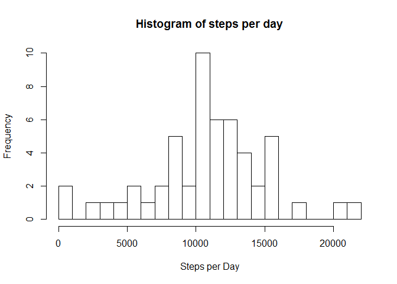
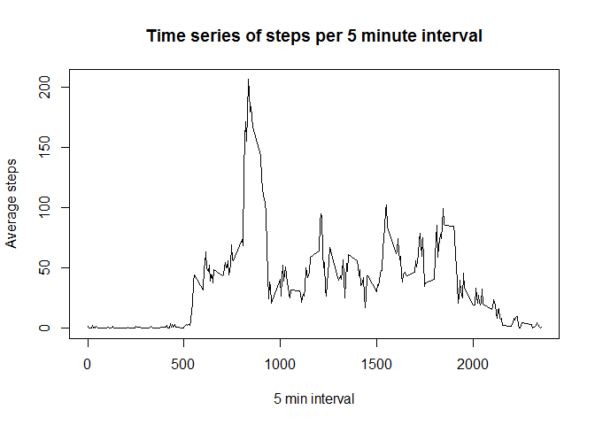
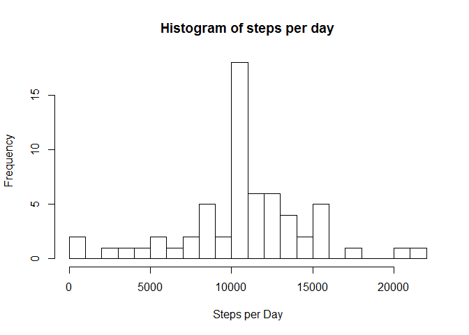

# Reproducible Research: Peer Assessment 1
Blaise Murraylee  


## Loading and preprocessing the data


```r
setwd("C:\\Users\\bem9\\Google Drive\\Documents 2016 -\\Education\\Coursera Data Science\\05 Reproducible Research\\Week 2\\Project\\RepData_PeerAssessment1")
data <- read.csv("activity\\activity.csv")
```


## What is mean total number of steps taken per day?

The total steps per day was found as below:

```r
steps.per.day <- aggregate(data$steps, by=list(data$date), FUN=sum)
```

Histogram of steps per day:


```r
hist(steps.per.day$x, breaks=16, xlab="Steps per Day", main="Histogram of steps per day")
```

<!-- -->

Calculating the mean and median steps per day:

```r
steps.per.day.mean <- round(mean(steps.per.day$x, na.rm=TRUE),2)
steps.per.day.median <- median(steps.per.day$x, na.rm=TRUE)
```

Mean of steps per day is 10766.19 and the median is 10765.


## What is the average daily activity pattern?

Aggregating data per 5 minute interval:

```r
steps.per.5.min.interval <- aggregate(data$steps, by=list(data$interval), FUN=mean, na.rm=TRUE)
```

Plot of steps per 5 minute interval and calculation of interval where maximum average steps occur:

```r
plot(steps.per.5.min.interval$Group.1, steps.per.5.min.interval$x, type = "l", xlab="5 min interval", ylab="Average steps", main="Time series of steps per 5 minute interval")
```

<!-- -->

```r
max.steps.interval <- steps.per.5.min.interval$Group.1[which.max(steps.per.5.min.interval$x)]
```

The interval where the average maximum of steps are taken is interval number 835.


## Imputing missing values

Calculation of the number of missin values:

```r
n.missing.values <- sum(1-complete.cases(data))
```

There are 2304 missing values in the dataset.

We will fill in missing values with the mean of that particular time interval using the code below:


```r
library(data.table)

data2 <- data
data2 <- transform(data2, steps=as.double(steps))
for (i in 1:length(steps.per.5.min.interval$x)){
    step <- steps.per.5.min.interval$x[i]
    intervals <- steps.per.5.min.interval$Group.1[i]
    
    setDT(data2)[data2$interval==intervals & is.na(data2$steps), steps:= step]
}
```

Histogram of new dataset:


```r
steps.per.day2 <- aggregate(data2$steps, by=list(data2$date), FUN=sum)
hist(steps.per.day2$x, breaks=16, xlab="Steps per Day", main="Histogram of steps per day")
```

<!-- -->

Computing the new mean and median steps per day:

```r
steps.per.day.mean2 <- mean(steps.per.day2$x, na.rm=TRUE)
steps.per.day.median2 <- median(steps.per.day2$x, na.rm=TRUE)
```

After imputing the missing data the new mean and median are: Mean of steps per day is 10766.19 and the median is 10766.19. Imputing the missing values has resulted in the mean remaining the same but the median increasing slightly.


## Are there differences in activity patterns between weekdays and weekends?

Load the dplyr package:

```r
library(dplyr)
```

```
## 
## Attaching package: 'dplyr'
```

```
## The following objects are masked from 'package:data.table':
## 
##     between, first, last
```

```
## The following objects are masked from 'package:stats':
## 
##     filter, lag
```

```
## The following objects are masked from 'package:base':
## 
##     intersect, setdiff, setequal, union
```

Transform the data to have a weekday/weekend factor variable, then compute the average steps per 5 minute interval for weekdays and weekends:

```r
data2<-transform(data2, date=as.Date(date))
data2 <- mutate(data2, week.period = as.factor(ifelse(weekdays(date)=="Saturday" | weekdays(date) == "Sunday","Weekend", "Weekday")))

steps.per.5.min.interval2 <- aggregate(steps~interval+week.period,FUN=mean, na.rm=TRUE, data=data2)
```

Plot the activity by weekday and weekend.

```r
library(ggplot2)

g <- ggplot(data=steps.per.5.min.interval2, mapping=aes(interval, steps)) + facet_grid(.~week.period)+geom_line()
g
```

<!-- -->

The weekday data shows a large peak at the start of the day and low activity the rest of the day while on weekends the activity peaks lower but remains higher for the rest of the day.


